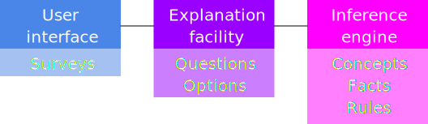

# DIEGO - A Data Driven Inference Engine written in GO 

[](https://goreportcard.com/report/github.com/andygeiss/diego)

DIEGO is a data driven, forward-chaining, rule-based expert system written from scratch.

[](diego.svg)

An expert system usually consists of a Knowledge Base, an Inference Engine and the User Interface.

* A **Knowledge Base** is a collection of different concepts with its facts and rules of a specific problem domain.
* An **Inference Engine** uses a top-down method to take facts as they become available and apply rules to draw conclusions.
* The **User Interface** uses an Explanation facility to explain the reasoning process to the user.

##### Table of Contents

- [Installation](README.md#installation)
    * [From Source](README.md#from-source)
- [Usage](README.md#usage)

## Installation

### From Source

    go get -u github.com/andygeiss/diego

## Usage

### Example Rules

    IF      A   (the "traffic light" is green)
    THEN    X   (the action is "go")
    
    IF      B   (the "traffic light" is red)
    THEN    Y   (the action is "stop")
    
This **Concept** could be defined as:

```go
concept := []*inference.Concept{
    &inference.Concept{
        Name:  "Example 1",
        Facts: []string{},
        Rules: []*inference.Rule{
            &inference.Rule{
                Conditions:  []string{"A"},
                Conclusions: []string{"X"},
            },
            &inference.Rule{
                Conditions:  []string{"B"},
                Conclusions: []string{"Y"},
            },
        },
    },
}
```

### Example Explanation

The conclusion "X" maybe is not obvious for the user of the expert system.
Thus a Explanation facility is used to map different questions which its option to the facts, which its hidden from the users eye.     

```go
survey := return []*explanation.Survey{
    &explanation.Survey{
        Name: "Example 1",
        Questions: []*explanation.Question{
            &explanation.Question{
                Prompt: "The traffic light is?",
                Options: []*explanation.Option{
                    &explanation.Option{
                        Name:  "green",
                        Value: "A",
                    },
                    &explanation.Option{
                        Name:  "red",
                        Value: "B",
                    },
                },
            },
        },
    },
}
```
 
See the [testdata](https://github.com/andygeiss/diego/tree/master/testdata) directory for more examples.

```go
import (
	expRepos "github.com/andygeiss/diego/pkg/explanation/repositories"
	"github.com/andygeiss/diego/pkg/inference/engines"
	infRepos "github.com/andygeiss/diego/pkg/inference/repositories"
	"github.com/andygeiss/diego/pkg/survey/services"
)

func main() {
    // Initialize the repositories by using JSON-files.
    expRepo := expRepos.NewFileRepository("../../../testdata/explanation.json")
    infRepo := infRepos.NewFileRepository("../../../testdata/inference.json")
    // Configure the engine to use a specific survey by name.
    engine := engines.NewDefaultEngine("SURVEY NAME", infRepo)
    // Combine the explanation repository and inference engine.
    service := services.NewDefaultService(expRepo, engine)
    // Get the facts by setting a specific condition.
    facts, err := service.GetResultsByFacts([]string{"#Q1 = 1"})
    ...    
}
```
