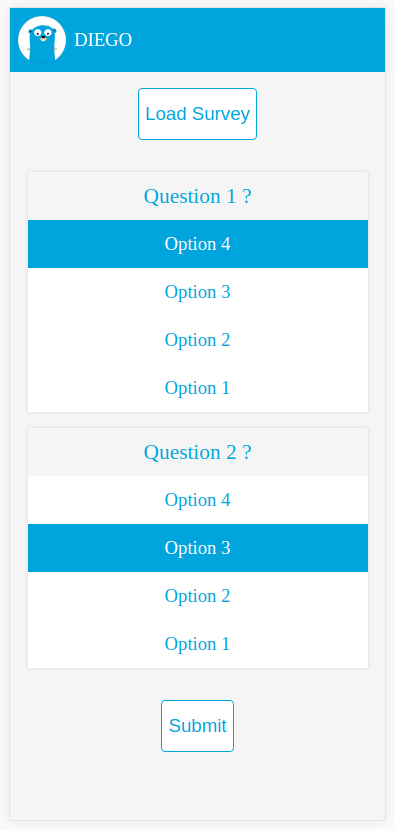
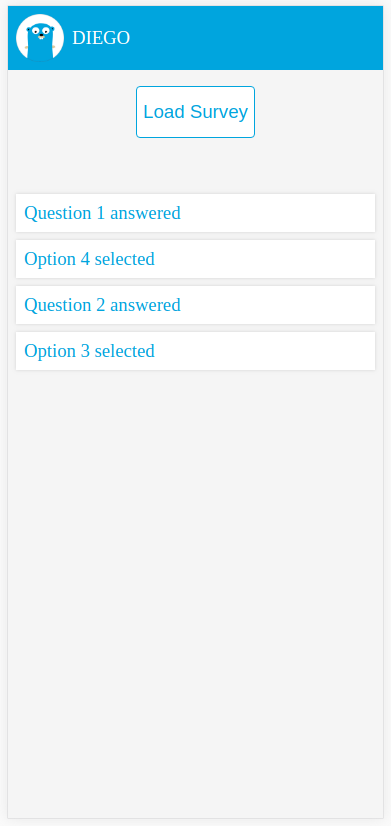

# DIEGO - A Data Driven Inference Engine written in GO 

DIEGO provides a framework to link practical user interfaces to domain specific knowledge of experts.

An expert system usually consists of three parts:
* a knowledge base (facts and rules),
* an inference engine (forward-chaining) and
* an user interface (web).

The inference engine uses a top-down method to take facts as they become available and
apply rules to draw conclusions.

The web-based user interface provides a survey with its questions and different options.
These options represents the facts, which could be used as an input for the inference engine. 

 

This repository follows the [Standard Go Project Layout](https://github.com/golang-standards/project-layout). 

##### Table of Contents

- [Installation](README.md#installation)
    * [Binaries](README.md#binaries)
    * [From Source](README.md#from-source)
- [Usage](README.md#usage)
    * [Running the Binary](README.md#running-the-binary)
    * [Running with Docker](README.md#running-with-docker)

## Installation

### Binaries

Get the current [release](https://github.com/andygeiss/diego/releases/tag/latest) and install it into your current environment.

### From Source

At first we will run the tests, compile a static binary and build a Docker image from scratch 
by using the current Git revision as a version tag: 

     ./scripts/test.sh && ./scripts/compile.sh

## Usage

### Configuration

* Define your facts and rules in the file <code>proddata/inference.json</code>.
* Define your survey questions and options in the file <code>proddata/explanation.json</code>.

### Running the Binary

Ensure that the environment variables are set.
Now run application by simply call the binary directly:

    sudo BIND=":80" \
        ENGINE_URL="http://127.0.0.1:3000" \
        SURVEY="SURVEY NAME" \
        APP_TITLE="DIEGO" \
        ./build/package/app &

    sudo BIND=":3000" \
        EXP_REPO="proddata/explanation.json" \
        INF_REPO="proddata/inference.json" \
        SURVEY="SURVEY NAME" \
        ./build/package/server &

### Running with Docker

    ./scripts/build.sh

    docker run -d \
        --name diego-app \
        --publish 80:80 \
        --volume `pwd`/vendor:/vendor \
        --volume `pwd`/web:/web \
        --env BIND=":80" \
        --env ENGINE_URL="http://127.0.0.1:3000" \
        --env SURVEY="SURVEY NAME" \
        --env APP_TITLE="DIEGO" \
        $USER/diego:latest /app

    docker run -d \
        --name diego-server \
        --publish 3000:3000 \
        --volume `pwd`/proddata:/data \
        --env BIND=":3000" \
        --env EXP_REPO="/data/explanation.json" \
        --env INF_REPO="/data/inference.json" \
        --env SURVEY="SURVEY NAME" \
        $USER/diego:latest /server
